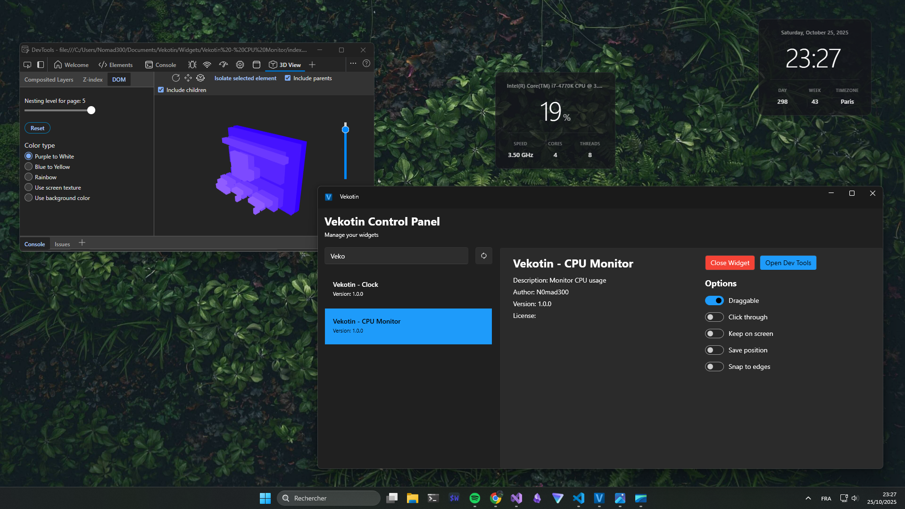
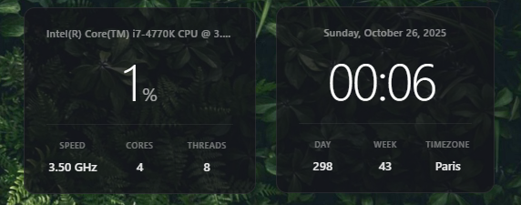

# Vekotin

**Vekotin is a widget system for Windows** where widgets are defined using **web technologies** to 
allow unlimited customization and are rendered using **Microsoft WebView2** to deliver good 
performance. The control panel is made with **WPF** and **[WPF-UI](https://github.com/lepoco/wpfui)** 
to provide a modern UI that allow you to control your widgets.



## Installation

You can grab pre-built binaries from the **Releases** section, or you can build it using **Visual 
Studio 2022** or by running the following commands in a terminal (be sure to have **git** and **.NET 
9.0 SDK** installed) :
```bash
# Clone the repository
git clone https://github.com/N0mad300/Vekotin.git

# Navigate to the project directory
cd Vekotin

# Restore dependencies
dotnet restore

# Compile the project
dotnet build
```

## Control Panel

The control panel contains :
- A list of the widgets detected in `C:\Users\Username\Documents\Vekotin\Widgets`
- A search bar above the list to search specific widget
- A refresh button next to the search bar to refresh the widget detection (if you edited one or added a new one)
- Informations about the selected widget (show what is in the `widget.json` of the widget folder)
- The "Open/Close widget" button
- The "Open Dev Tools" button (can help when making a new widget)
- The different options of the widget

The general options of widget are :

| Option         | Description                                          |
| -------------- | ---------------------------------------------------- |
| Draggable      | Whether the widget can be moved or not               |
| Click through  | Whether the widget is invisible to the mouse or not  |
| Keep on screen | Whether the widget can go out of screen limit or not |
| Save position  | Whether we should remember where the widget was      |
| Snap to edges  | Move the widget to edges close to him                |

The state of the options of each widget is stored in the **app config file**.

The **app config file** is located at `C:\Users\Username\AppData\Roaming\Vekotin\vekotin.json` and 
isn't intended to be edited by the user, it define the path to widgets folder and store the options of 
each widget.

The **cache of WebView2** is located at `C:\Users\Username\AppData\Local\Vekotin`.

>**Important** : When you close the control panel the app is still running in background (to allow 
widget to run), you need to close the app through is tray icon

## Widgets

The widget are located at `C:\Users\Username\Documents\Vekotin\Widgets`, the folder will be 
create at the first launch of the app with two widget examples (**Clock** and **CPU Monitor**). **Each 
widget must have his own folder** and need to have a `widget.json` and `index.html` file in it to be 
detected by the app.



The `widget.json` file act as a manifest for each widget and should look like this :
```json
{
  "Name": "str",
  "Author": "",
  "Version": "",
  "License": "",
  "Description": "",
  "Width": 1,
  "Height": 1,
  "Bridges": []
}
```
>**Important** : The `Name` value cannot be empty and `Width` and `Height` must contain a number 
greater than zero, rest of value can be null

The `"Bridges": ["CPU", "RAM"]` value is use to define to which bridges the widget will be get 
access

To define draggable region on your widget you need to use the CSS property `-webkit-app-region: drag;`

## Bridges

The widgets can use bridge in JavaScript to access OS level features (get hardware informations, control media playback (via SMTC), etc.).

Currently the only available bridge is the CPU bridge, here is an example of how to use it in 
JavaScript (you can also check the code of CPU Monitor example widget) :
```javascript
const cpuBridge = window.chrome?.webview?.hostObjects?.cpu;

if (cpuBridge) 
{
    try 
    {
        const cpuUsage = cpuBridge.GetUsage();
    }
    catch (error)
    {
        console.error("Error fetching CPU usage:", error);
    }
}
```

## Sponsor

[](https://www.patreon.com/cw/N0mad300?utm_medium=unknown&utm_source=join_link&utm_campaign=creatorshare_creator&utm_content=copyLink) 
[](https://ko-fi.com/n0mad300)
[](https://github.com/sponsors/N0mad300)
[](https://buymeacoffee.com/n0mad300)
[](https://liberapay.com/N0mad300/)